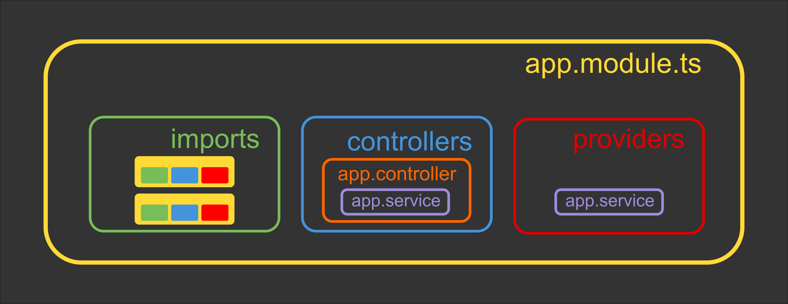
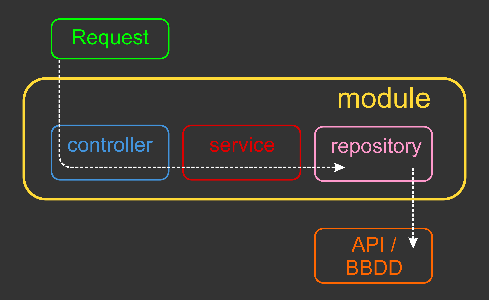
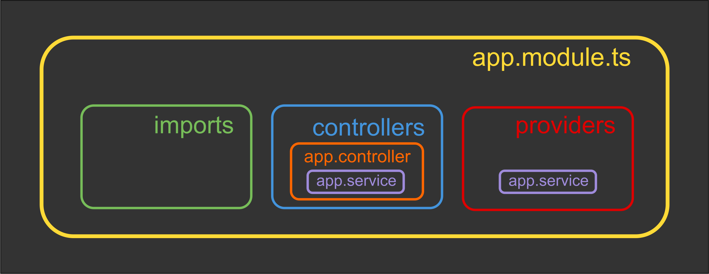
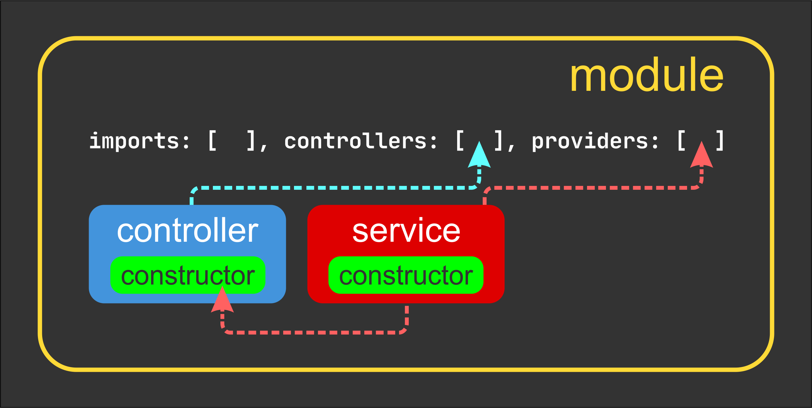

# Nest JS - Fundamentals I

[Volver a Inicio](../README.md)

## Módulos

## Inyección de Dependencias

## Request, Módulos, Controladores y Servicios

## Módulos, Controladores y Servicios

## 🎯 Resumen

- Los MÓDULOS son CLASES definidas mediante el decorador @Module que actúan como unidades organizativas dentro de la aplicación.
  - Utilizan Servicios, Controllers e incluso otros Módulos creando una unidad independiente y autónoma.
- Los SERVICIOS son los responsables de la lógica de negocios y las operaciones de datos (MÉTODOS), con el propósito de que puedan ser reutilizados por diversos controladores.
  - Son usados por los CONTROLADORES
    Debemos declararlos en los MÓDULOS
- Los CONTROLLERS son clases que reciben las solicitudes entrantes
  - Manejan una ruta específica, evalúan el método HTTP.
  - Desestructuran la Información Recibida
  - Invocan al SERVICIO correspondiente
  - Devuelven la respuesta al cliente.
  - Debemos declararlos en los Módulos.

## Organización de Proyectos

### Enfoque Modular

- Organiza el proyecto en carpetas que representan roles o componentes claves.
- Las carpetas contienen archivos que se centran en una función específica.
  src/
  |-- controllers
  |-- modules
  |-- services

### Enfoque Funcional (el recomendado en Nest JS)

- Organiza tu proyecto en carpetas que representan características específicas del proyecto.
  src/
  |-- todos
  |-- users