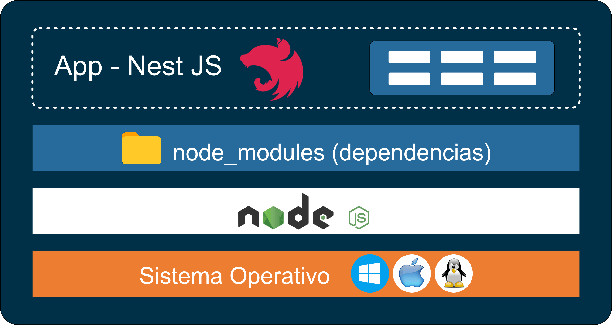
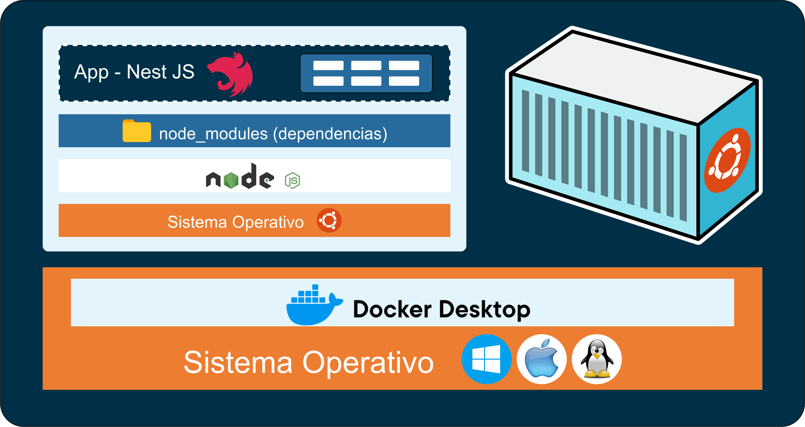

# Nest JS - Docker

[Volver a Inicio](../README.md)

## DOCKER

### ¿QUÉ PROBLEMA VIENA A RESOLVER?



### UN EJEMPLO




### LINKS

- [Docker - Documentación](https://www.docker.com/)
- [Descargar para Windows](https://www.docker.com/products/docker-desktop/)
- [Instructivo de Instalación para Windows](https://docs.docker.com/desktop/install/windows-install/)
- [Documentación para desarrolladores](https://docs.docker.com/?_gl=1*1m0ompz*_ga*MjAyNTczMDU3OS4xNzE0NTE3MzMx*_ga_XJWPQMJYHQ*MTcxNDUxNzMzMS4xLjEuMTcxNDUxODY5OS41Ni4wLjA.)
- [Docker Hub](https://hub.docker.com)
- [Docker Hub - postgres](https://hub.docker.com/_/postgres)
- [npkill - Borrar node_modules](https://www.npmjs.com/package/npkill)

### VERIFICAR INSTALACIÓN

- Ingresamos en la Terminal Integrada:

```bash
docker
# Nos brinda las opciones que podemos ejecutar en su entorno

docker-compose
# Nos brinda las opciones que podemos ejecutar en su entorno
```

⚠️ Recordar que Docker Desktop debe estar en ejecución para ejecutar sus comandos!!!

### PLUGIN PARA VISUAL STUDIO CODE

- [Link](https://code.visualstudio.com/docs/containers/overview)

### EJEMPLO DE DOCKER FILE

```dockerfile
FROM node:18.12          # Entorno de ejecución a utilizar
WORKDIR /app             # Carpeta raíz del contenedor
COPY . ./                # Ejecutamos TODOS los archivos(.) de raíz(./)
RUN npm install          # Ejecuta "npm install" (en Contenedor)
EXPOSE 3000              # Puerto que expondrá el Contenedor
CMD ["node", "app.js"]   # Comandos a ejecutar
```

### CREAR IMAGEN

- Comando: docker build
- Especificamos ubicación del Dockerfile: "." => En la misma carpeta

```bash
docker build .
```

### INICIALIZAR CONTENEDOR

- Comando: docker run
- Indicamos puertos: -p `<puertoHost>:<puertoContenedor>`
  - No necesariamente deben ser los mismos
- Indicamos "id" de la Imagen: sha256:---

```bash
docker run -p 3000:3008 <imagenId>
```

### ALGUNOS COMANDOS DE DOCKER

```bash
# IMAGENES de Docker
docker images
docker image ls

# CONTENEDORES en ejecución
# ps: process status
docker ps

# Todos los CONTENEDORES
docker ps -a
docker ps --all

# Detener CONTENEDOR
docker stop <nombreContenedor>

# Networks
docker network ls

# Borrar IMAGEN
dockre rmi <nombreIMAGEN_o_idImagen>

# Borrar CONTENEDOR
docker rm <nombreContenedor_o_idContenedor>

# Borrar NETWORK
docker network rm <nombreNetwork_o_idNetwork>

# Correr CONTENEDOR existente
docker start <puertoHost>:<puertoContenedor> <nombreContenedor_o_idContenedor>
```

### CONECTAR CONTENEDOR (API) - CONTENEDOR (BBDD)

1. Descargamos imagen de postgre desde Docker Hub

```bash
docker pull postgres
```

2. Creamos contenedor de postgre a partir de la imagen

```bash
docker run --name postgresdb -e POSTGRES_PASSWORD=root -e POSTGRES_DB=demo -d postgres
```

3. Obtener IP del contenedor "postgres"

```bash
docker inspect postgresdb
```

4. CONFIGURAR "typeorm.ts" REEMPLAZANDO:

```ts
const config = {
	type: 'postgres',
	database: process.env.DB_NAME,
  // host: 'localhost'
	host: '172.17.0.2',
```

5. CREAMOS IMAGEN Y CONTENEDOR DE NUESTRA APP

```bash
docker build . # Copiamos "id" de la imagen
docker run -p 3000:3000 <sha256:containerId>
```

### USO DE UNA NETWORK PARA CONECTAR CONTENEDOR-CONTENEDOR

1. Creamos network

```bash
docker network create networkdemo
```

2. Montamos Contenedor de Postgres a la red creada

```bash
docker run --name postgresdb -e POSTGRES_PASSWORD=root -e POSTGRES_DB=demo --network networkdemo -d postgres
```

3. En archivo "typeorm.ts" modificamos "host":

- En ARCHIVO "typeorm.ts" Modificamos "host":

```ts
host: 'postgresdb', // Nombre del contenedor de la BBDD
```

- Montamos Contenedor de la App a la Network:
  - El CONTENEDOR "postgresdb" ya está asociado a la Network

```bash
docker build .
docker run -p 3000:3000 --network networkdemo <sha256:containerId>
```

### PERSISTENCIA DE DATOS => VOLUMENES

```bash
docker run --name postgresdb -e POSTGRES_PASSWORD=root -e POSTGRES_DB=demo --network networkdemo -v pgdata:/var/lib/postgresql/data -d postgres
```

### DOCKER COMPOSE

Hay un ejemplo de archivo "docker-compose.yaml" en la carpeta "XpertReadmes".

Configuración

- Creamos nuevo archivo "docker-compose.yaml" y seteamos configuración.
  - Recordar que en archivos yaml es importante la identación!!!
- Agregar variables de entorno en archivo ".development.env".
- No olvidar setear "synchronize" y "dropSchema" de typeorm en false.
- Correr en consola el comando `docker compose up` en la ubicación del archivo "docker-compose.yaml".
